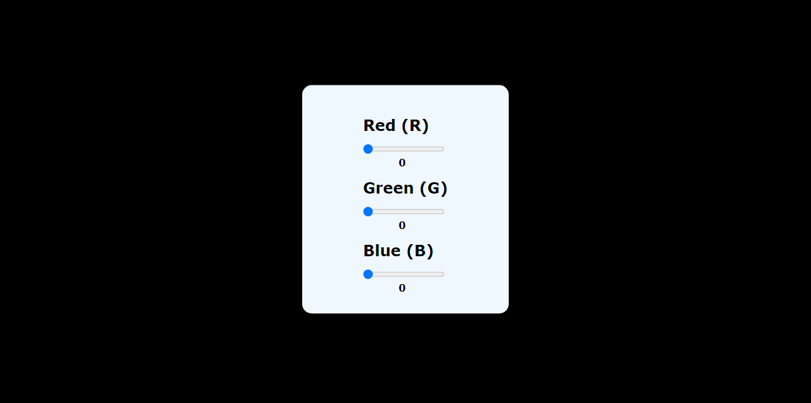

# RGB Color Picker

The RGB Color Picker tool allows users to adjust the red, green, and blue values using range input sliders and enables users to change background color

## Preview 

  - <a href="https://vanesabordanaro.github.io/rgb-color-picker/">Live Preview</a>

## Overview

</a>
